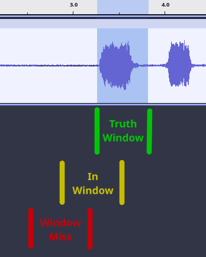
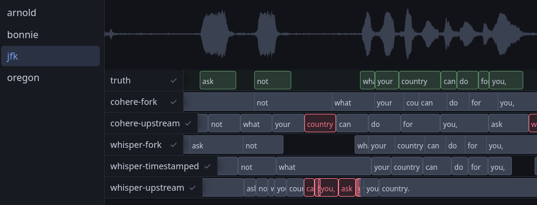
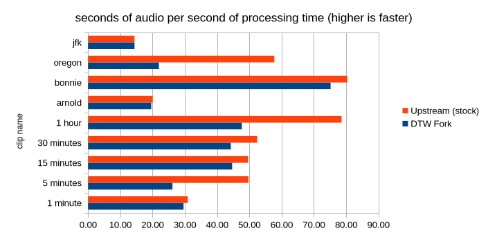
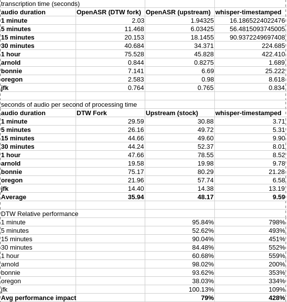

# OpenASR Timestamp Improvement

## Motivation

[OpenASR](https://github.com/QuintinShaw/openasr) supports transcription for many open models, but my tests showed that word-level timestamp accuracy is pretty poor especially for [whisper](https://huggingface.co/openai/whisper-large-v3-turbo). I know for a fact that this can be better, as evidenced by [whisper-timestamped](https://github.com/linto-ai/whisper-timestamped), which to my knowledge offers some of the most accurate timestamps possible for whisper. 

The whisper-timestamped project uses a post-processing step called [Dynamic Time Warping](https://en.wikipedia.org/wiki/Dynamic_time_warping) (DTW). By applying this same approach to the whisper implementation in OpenASR, we can achieve dramatically more accurate word timestamps (An improvement on the order of ~1.5s -> ~150ms).

In addition, to demonstrate that DTW refinement isn't just benificial to whisper, I've attempted to apply it to [cohere](https://huggingface.co/CohereLabs/cohere-transcribe-03-2026).

Using DTW, acoustic processing, and [VAD](https://en.wikipedia.org/wiki/Voice_activity_detection), we can improve not only the word timestamp accuracy, but reduce hallucinations, i.e. instrumental music segments that cause the model to output nonsense or repetitive phrases like "thank you for watching" that can cascade into real speech segments, causing not only false positives but false negatives as well.

Check out [my fork](https://github.com/chameleon-ai/openasr) and take a look at the test results and see for yourself.

## Yes, It's Vibe Coded

I'm going to be really honest. I don't know much about tweaking inference code and I'm not a [Rust](https://rust-lang.org/) programmer. I barely know how to do inference with [pytorch](https://pytorch.org/). Without an AI agent, I wouldn't even know where to begin, so I fired up [opencode](https://github.com/anomalyco/opencode/) using a [self-hosted](https://chameleon-ai.github.io/ryzen-ai-max/) instance of [Qwen3.8](https://huggingface.co/Qwen/Qwen3.8-27B) and gave it a shot. I was pretty skeptical in its ability to make truly meaningful improvements to the codebase, but here we are, and I'll present the evidence of improvement and let you decide if the results are good or not. And no, I didn't ask AI to make this writeup, these are some good old fashioned hand-rolled docs.

Basically, I directed Qwen at the openasr codebase, gave it general direction, and came up with test cases for it to bash its head against. **I think robust test cases are the key here**. I started off with a few small cases to get the ball rolling. It overfit to those cases, but as I added more, it was able to generalize more and more. After about 15 cases it appeared to reach the upper limit of accuracy, becoming on-par with *and in some cases beat* whisper-timestamped. I knew I had enough tests when I introduced new ones that immediately scored well and required no substantial code changes.

## Test Structure

A lot of my tests contain copyrighted audio, and I don't want to deal with a takedown notice, so I won't be sharing a good bit of them, but I've included a 
[sample test suite](https://github.com/chameleon-ai/openasr-timestamp-improvement/sample-tests/) that shows the test structure and a couple examples.

Start with a directory split into a subdirectory per clip. Each subdirectory has the clip as well as a truth reference:
```
.
├── arnold
│   ├── arnold.mp3
│   └── truth.json
├── bonnie
│   ├── bonnie.opus
│   └── truth.json
└── jfk
    ├── jfk.wav
    └── truth.json
```

**The truth reference is a hand-modified transcript where the words and timestamps are adjusted to the best times possible**. This is an arduous process for long clips. I've spent hours hand tweaking timestamps by looking at waveforms in audacity, but it's absolutely necessary to establish good baselines.

To generate a transcript, run openasr:
```
openasr transcribe --model whisper-large-v3-turbo jfk/jfk.wav --word-timestamps -f verbose_json -o "jfk/whisper-large-v3-turbo.json"
```

Then you'll have a directory structure that looks like this:
```
└── jfk
    ├── jfk.wav
    ├── truth.json
    └── whisper-large-v3-turbo.json
```

Once you have the truth and all the other transcripts you want, analyze them with the various scripts included in the test suite.

`compare.py` shows some basic metrics:
```
$ python compare.py jfk/
File                                Recall    Prec      F1     WER  StartErr  EndErr  TempErr  AbsStart   AbsEnd  InWin
qwen3-asr-1.7b.json                  1.000   1.000   1.000   0.000     0.041   0.050    0.046     0.054    0.051   100%
whisper-timestamped.json             1.000   1.000   1.000   0.000     0.127   0.056    0.091     0.170    0.106   100%
whisper-large-v3-turbo.json          1.000   1.000   1.000   0.000     0.083   0.170    0.127     0.145    0.212   100%
cohere-transcribe-03-2026.json       1.000   1.000   1.000   0.000     0.130   0.200    0.165     0.171    0.214   100%
```

`diagnose.py` shows a more detailed look at the predominant sources of timing error:
```
$ python diagnose.py arnold/
### whisper-large-v3-turbo.json
  matched=35/35  truthSpan=14.7s  candSpan=14.9s  fitScale=0.991 (over-stretched)  TempStart=0.107s
  signed drift (truth-cand, post-scale) per 15s truth-time bucket:   0s:-0.00  15s:+0.00
  head/tail start error (post-fit, truth-cand; + = cand early): head=-0.06s ('Rick,': t[1.13] c[1.06])  tail=-0.07s ('parents': t[15.87] c[15.95])
  worst-10 normalized start errors; >0.5s tail: n=1 accounts for 18% of the 3.8s error
    err=  0.69  t[  8]    4.94 'is'               -> c[  8]    4.15 'is'
    err=  0.33  t[ 16]    8.68 'in'               -> c[ 16]    8.28 'in'
    err=  0.30  t[ 17]    8.83 '1977'             -> c[ 17]    9.07 '1977'
    err=  0.26  t[ 18]   10.07 'when'             -> c[ 18]    9.75 'when'
    err=  0.20  t[ 21]   10.56 'her,'             -> c[ 21]   10.71 'her,'
    err=  0.20  t[  1]    1.83 'the'              -> c[  1]    1.50 'the'
    err=  0.19  t[ 25]   12.23 'tournament.'      -> c[ 25]   12.39 'tournament.'
    err=  0.16  t[  6]    2.65 'smoking'          -> c[  6]    2.70 'smoking'
    err=  0.15  t[ 10]    5.32 'simple.'          -> c[ 10]    5.37 'simple.'
    err=  0.14  t[  7]    3.17 'stogies'          -> c[  7]    3.19 'stogies'
```

## Test Content

With a large enough corpus, the above test structure is sufficient for the agent to make significant gains on the openasr codebase. With each directed task, it's also able to make new diagnostic utilities on the fly to help with the task at hand.

**A diversity of content is necessary**. For example:
- **Regular "easy" clips**. For example, the [jfk](https://github.com/QuintinShaw/openasr/blob/main/fixtures/jfk.wav) audio from the openasr repo is a clearly annunciated sample under 30 seconds. Perfect for establishing a baseline and the short duration means quick turnaround.
- **Long clips**. The audio is usually split into 30-ish second chunks. There needs to be a corpus of clips that span multiple minutes so that chunking, seam-stitching, and drift can be properly tested.
- **Music**. Probably self-evident, but:
  - Loud background noise can interfere with DTW and acoustic alignment, creating false positives for word starts as well as muddled word boundaries. A few songs with an especially loud music floor can really help dial this in.
  - For comparison I also isolated the vocals with [Ultimate Vocal Remover](https://github.com/Anjok07/ultimatevocalremovergui) and provided the same truth reference to the vocal isolated version. This was pretty effective at determining if the time inaccuracy was due to music or some other factor.
  - Sustained words can also mess up the end timestamps. While this is rare in regular speech, words are usually dragged out at the end of each stanza of a song. A model might be good at getting the start timestamp correct but cut off the end of the word in these cases.
  - My test corpus has for example, the B52's [Planet Claire](https://www.youtube.com/watch?v=uaXtqSmUlxA) and [Rock Lobster](https://www.youtube.com/watch?v=vz65vonktMA), as well as an excerpt of [Thriller](https://www.youtube.com/watch?v=sOnqjkJTMaA). These have repeated stanzas, sustained words, overlapping vocals, and long instrumental stretches.
- **Quiet Vocals**. An [ASMR](https://www.youtube.com/watch?v=0L5_4PPz_qQ) clip or [two](https://www.youtube.com/watch?v=r69uTfCErmc) should do nicely. Long pauses, slow speech, vocal non-speech (humming, etc.) and non-vocal noises that can cause hallucinations and misalignment.
- **Fast Speech**. DTW alignment is supposed to adapt to the speed of someone's speech. If calibrated on only slow deliberate speech, there will be a lot of misses when someone talks fast. I know of a [vtuber](https://www.youtube.com/@EepySleepyCh/streams) or [two](https://www.twitch.tv/malfina/videos) that typically speaks fast. A few minutes of this material is good reference.
- **Repeated Words**. Sometimes models (especially whisper) hallucinate on non-speech and that takes the form of repeated phrases like "thank you". To suppress this and save the model from outputting nonsense on real words, a degenerate repeat guard is added that suppresses this if it happens too much. However, if the repeat guard is too agressive, it can suppress true speech. Finding a few counterexamples can help tune the repeat guard. Enough clips of natural speech will have a few of these instances, but songs with repeated stanzas are especially good, and [this](https://www.youtube.com/watch?v=LgwCVQdW1HM) is the final boss of repetition checks.
- **Long periods of non-speech**. Live streams are a good example that can have multiple minutes before speech starts. For example, [this](https://www.youtube.com/watch?v=Reb5R5Y9tzU) stream where I've included a snippet of the first few minutes in the test suite. This clip alone is hugely valuable and checks a lot of the boxes all at once. The [Tequila](https://www.youtube.com/watch?v=U_JFLb1IItM) song is another brutal example; the entire song only has 3 words, and is a fairly good litmus test for hallucination.

Note that **Word Error Rate is not something to test in and of itself**. Everything listed above has to do with timing, a post-processing step. Word error rate is a function of the model itself and there's not much we can do about it. Audio that's hard to decipher isn't very useful because if the model doesn't output the right word, it can't be compared against the truth reference.

Also this probably goes without saying but **this isn't training data**, these are in-the-wild evaluation samples for tweaking pre and post processing.

## Metrics

### Text Quality (F1)

This measures recall and precision. A low F1 score can point to dropped segments of text. Chasing F1 led to refining the degenerate repeat guard, seam stitching logic, and temperature ladder.

### Temporal Error (TempErr)

Temporal error is how close the start and end timestamps are to the truth reference on average. Lower is closer. This is a good indicator with all else being equal, but it doesn't tell the full story. For instance, words could be missing or mismatched, or single instances could throw off the score.

### In-Window Percentage (InWin)

This is a good ballpark score. The "In-Window" percentage measures the words that overlap with the truth reference, even if they aren't spot-on. By chasing InWin, you know you're going in the right direction.



### Measurement Examples

Here are some measurements from the included test samples. For a full report, run `suite.py` located in the [sample test suite](https://github.com/chameleon-ai/openasr-timestamp-improvement/sample-tests/).
|"bonnie" clip|F1|TempErr|InWin|
| ----------- | ----------- | ----------- | ----------- |
| cohere (stock) | 0.888 | 3.522 | 11% |
| cohere (DTW) | 0.914 | 0.410 | 92% |
| whisper (stock) | 0.000 | N/A | 0% |
| whisper (DTW) | **0.918** | **0.234** | **95%** |

In the above "bonnie" test, stock `whisper-large-v3-turbo` suffers a *complete collapse* from the leading music. The fork recovers the text fairly well.

|"jfk" clip|F1|TempErr|InWin|
| ----------- | ----------- | ----------- | ----------- |
| cohere (stock) | 1.000 | 0.502 | 36% |
| cohere (DTW) | 1.000 | 0.165 | **100%** |
| whisper (stock) | 1.000 | 1.757 | 14% |
| whisper (DTW) | 1.000 | **0.125** | **100%** |

In the above "jfk" test, where F1 is perfect across the board (zero word errors), we can see a dramatic improvement in timestamp quality for the DTW fork with timestamps accurate to ~125 ms.

|"arnold" clip|F1|TempErr|InWin|
| ----------- | ----------- | ----------- | ----------- |
| cohere (stock) | 1.000 | 0.337 | 51% |
| cohere (DTW) | 1.000 | 0.184 | 94% |
| whisper (stock) | 1.000 | 2.250 | 9% |
| whisper (DTW) | 1.000 | **0.121** | **100%** |

Basically the same case above for the "arnold" test case. Both "arnold" and "jfk" are short and fit within a single window, so seam stitching doesn't come into play here.

|"oregon" clip|F1|TempErr|InWin|
| ----------- | ----------- | ----------- | ----------- |
| cohere (stock) | 0.672 | 0.869 | 2% |
| cohere (DTW) | 0.647 | **0.242** | 93% |
| whisper (stock) | 0.381 | 2.346 | 20% |
| whisper (DTW) | **0.881** | 0.323 | **94%** |

In the above "oregon" clip, stock whisper omits an entire chunk of text due to the way that prompt carry is implemented. In the fork, all the missing text is properly recovered.

### Visualization
A local webserver is included in the test suite to help visualize timestamps. Launch it with the command:
```
python visualize/visualize.py
```


Words detected as out of window are highlighted red. It also highlights which words are in-window at a particular point in time during playback.

## Specific Problems Addressed

Keep in mind that this is filtered through my brain as it was explained to me by AI, I'm doing my best to understand the concepts but forgive me if some of the specifics are inaccurate.
- **Dynamic Time Warping** added as a post-processing step to refine timestamp accuracy. This is the major feature that is doing most of the heavy lifting.
- **Start and end timestamp trimming** based on an acoustic envelope. Really good at trimming down early starts and late ends on clips with very little background noise.
- **Seam stitching** (when multiple individual slices are stitched back together for the full transcript) in the upstream OpenASR codebase caused dropped phrases in many clips as well as degraded the timing. This has been tweaked so that phrases and accurate timing information aren't lost.
- A **Denenerate Repeat Guard** meant to suppress transcript degradation was over-agressive and dropped simple repeated phrases, common in music and longform livestreams. In addition to tuning the repeat guard itself, a **temperature ladder** was added to attempt to recover dropped phrases when the guard trips. This comes at the risk of more hallicination, but in my test corpus this helps more than hurts, as entire sentences are recovered at the cost of occasional single word hallucinations.
- **Prompt carry** (when you feed the previous transcript chunk in as the prompt for the next chunk) for whisper sometimes caused degredation and skips of whole sentences. A couple tweaks: 1. Stripping timestamps when carrying forward increased accuracy, and 2. when carry causes the model to skip an audible slice there is now special code that recovers the speech in that section.
- **Voice Activity Detection (VAD) gate** added to prevent hallucinations in non-speech segments. This trips when an entire segment doesn't actually contain speech, skipping decoding for that segment.

## Performance Impact

Tested on [upstream commit 99d20e8](https://github.com/QuintinShaw/openasr/commit/99d20e867993583789d213ec01386df7d659ba0a) vs [fork commit 300b316
](https://github.com/chameleon-ai/openasr/commit/300b3168a59a85a7bc1e6e391d4af7b6f77da041). Build command:
```
cargo build --release -p openasr-cli --features hip
```

Benchmarks were run on an AMD 6800XT 16GB.

Performance is highly dependent upon the specific audio. You can get an idea from the 9 samples benchmarked here:


Relative performance among these samples ranges from **on-par** to **38%** (2.6x *slower*). The longer processing time is usually due to retry attempts on a segment in order to recover lost text. In my opinion the more accurate and complete transcript is very much worth paying a performance penalty.



The full benchmark statistics are recorded [here](https://github.com/chameleon-ai/openasr-timestamp-improvement/assets/benchmarks.ods) if you wish to review them.